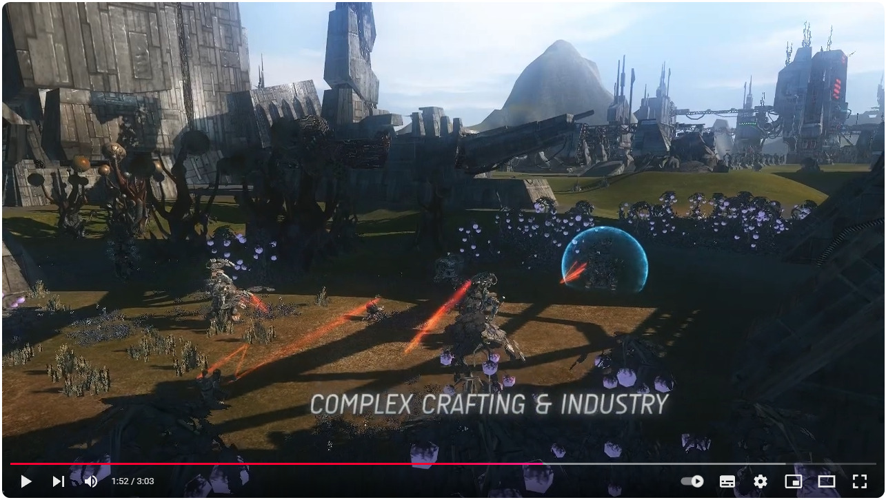

# What is Perpetuum?

[Perpetuum](http://www.perpetuum-online.com/) is a sci-fi MMORPG by Avatar Creations Ltd. Its setting is a far away planet inhabited by robots. It is now available for free on [Steam](https://store.steampowered.com/app/223410/Perpetuum).

# Perpetuum Client

[SteamDB](https://steamdb.info/) information about [Perpetuum](https://steamdb.info/app/223410/info/) client. The client can be launched with a [Vulkan-based translation layer](https://github.com/doitsujin/dxvk) on Windows to improve performance. Due to low system requirements, several copies of clients can be launched on one computer. To do this, copy the directory with the game files to a new folder and launch from there. To disable the game integration with Twitch (it still does not work), use the command line key "-disabletwitch".

# Perpetuum Dedicated Server

[SteamDB](https://steamdb.info/) information about [Perpetuum Dedicated Server](https://steamdb.info/app/693060/info/). In the Steam client, the server is in the category - Tools. The distribution is designed for the Windows operating system, but the server can be built for Linux (runs through Mono or .NET). Microsoft SQL Server is used as a database server (free edition is used).

# The Open Perpetuum Project

[The Open Perpetuum Project](https://openperpetuum.com/) is an ongoing [development](https://github.com/OpenPerpetuum) effort  - a freely accessible persistent server and community development effort for Perpetuum.
